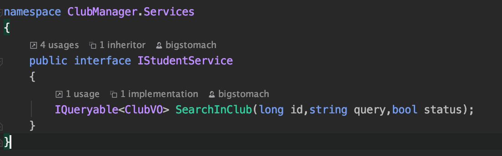

# ClubManager 开发流程
## DataGrip
1. 左边栏"+"号选择"Data Source"->Oracle  

2. 在弹出窗口中的红色框内输入相应的数据，密码和用户名相同，尝试连接成功后apply  

3. 能够看到左边栏出现数据库和相关表结构，展开可以查看字段，双击能够查看内容(没填几个，就学生用户社团一点点)  

4. 增加删除记录(点击"+"/"-"填好之后点击绿色的箭头和绿色的✅)，修改差不多就修改相应的记录再重复绿色的操作  

5. 导出建表语句  

6. 查看建表语句  
 
7. "+"下新建"Query Console",然后可以写sql语句对表进行操作，不要擅自把表结构改了！！  

## 协作方式
采用合作者方式，具体方法看链接对合作者方式的介绍
https://ideepspace.gitee.io/learngit/docs/gitduo-ren-xie-zuo.html  
注意需要先**创建并切换到新的分支**
```bash
$ git checkout -b feature_xxxx //xxxx需要改成你负责的功能
```
写完一个功能之后，每次提交时提交这个新分支
```bash
$ git push origin feature_xxxx //xxxx需要改成你负责的功能
```
每次提交完新的功能找一个人来review、提出意见，最后找我来合并


## c# .net core
### 项目文件组织

* Dependencies 里面是项目的依赖，依赖的框架sdk，依赖的许多包
* Properties 里面是项目启动时的配置
* Controllers 是处理接口的一些类
* Helpers 一些辅助的工具类
* Models 数据库表所对应的类，类的属性就是数据库表中的字段
* QueryObjects 查询对象类，提供给Controllers的接口使用
* Services 业务逻辑层，controller通过调用Services的接口来完成对数据库的操作，增删改查操作都在这里写
* ViewObjects 视图对象类，也就是返回给前端的数据的类，也是提供给Controllers的接口使用  
* program.cs是程序运行入口，startup.cs是运行时的配置包含服务注入等

**总的来说，包含接口层Controllers，业务服务层Services，数据库访问层ModelContext(EF框架为我们处理好了)**

### 工作步骤  
即完成一个接口需要的操作，以inClub接口为例
1. 在controllers文件中找到接口应该是哪类用户的操作，inClub应该是学生查看自己所处社团的操作，因此将接口写在StudentsController.cs文件中
 
在类上面的注释的含义见下，都已经写好
    1. 根据角色确定权限，此控制器类的角色是Student，只有Student才能调用此控制器类中的接口
    2. 查询的url，即baseUrl/[controller],这里controller就是student
    3. 这是个API控制器
2. 构造函数实际上就是说明依赖了IStudentServices这个业务逻辑接口类
3. 只需要写的就是接口的实现

* 注释含义
    1. 具体接口的url连接字符串是"inClub"，因此此url就应该是https://localhost:5001/communitySystem/Student/inClub
    2. 这是注释接口返回的statusCode和相应的返回类型，比如这里指的是返回200成功，并且返回类型为PaginatedList<ClubVO>类型(进行分页过的返回类型)的json数据
* 具体方法
    1. 返回类型一般都写IActionResult，这样返回时可以写Ok()，NotFound(),BadRequest(),NoContent()，括号里面写上返回的参数
    2. 传入参数也就是前端请求的参数，请封装在类中，把这个类放在QueryObjects文件夹中，注意大小写规范取名要和接口名相关并且最后加上QO，如果参数只有一个可以不封装直接写
    3. Utils就是工具类，提供获取当前用户的id和username来确认身份
    4. __studentService.SearchInClub就是Services业务逻辑层的接口，需要在IStudentService声明，在StudentService写出方法的具体实现
    
    
    5. 具体对数据库的增删改查可以结合着各种service文件看如何写
        * 增删改可以看AdminService.cs写的
        * 查询的话可以查一下linq语法，这里贴个链接 https://docs.microsoft.com/zh-cn/ef/core/querying/complex-query-operators , https://docs.microsoft.com/zh-cn/ef/core/querying/raw-sql, https://docs.microsoft.com/zh-cn/ef/core/querying/related-data, 可以把文档相关的都看一看
        * 这个有些不太相似但是语法可以参考 https://docs.microsoft.com/zh-cn/aspnet/core/data/ef-rp/read-related-data?view=aspnetcore-2.2&tabs=visual-studio 
        * 最好linq和原始sql都能写
    6. 最后Controller接口的返回类型请也封装成类，放在ViewObjects文件夹中，注意规范，分页的就直接仿照上面图的写法，具体实现已经完成
    
 ## postman
 也就是用于测试接口的工具
 
 * 选择请求方法、请求地址、点击body写入请求参数，send之后右边栏会显示返回参数，要是5开头那就是发生内部错误请在后端的output查看
 * !!!注意每次测试前需要拿接口相关的用户来登录(如果用户类型错误会返回没有权限)，获取token，然后测试时需要在headers添加一个字段key是Authorization，value是bearer加上token的字符串，否则会返回401没有身份认证  
  
 
 
    