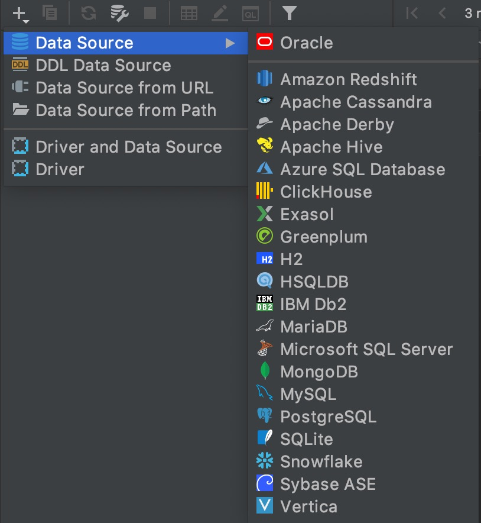
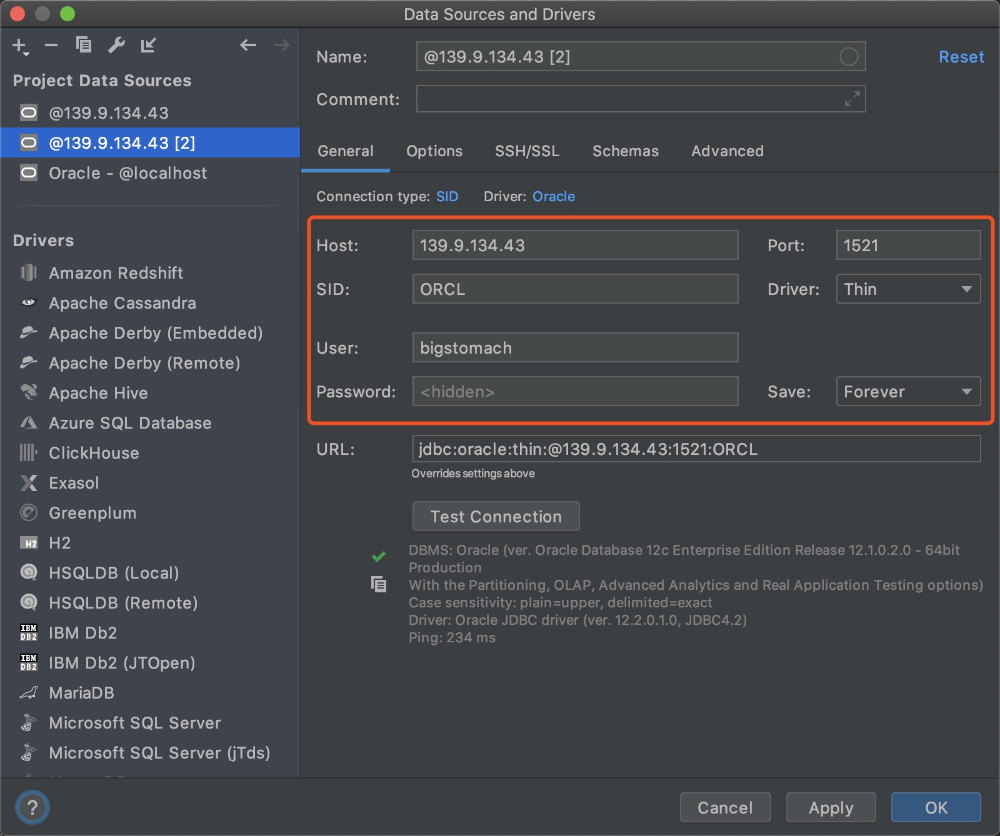
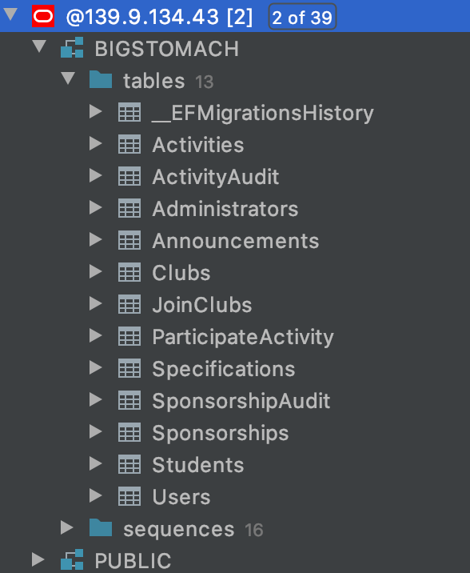
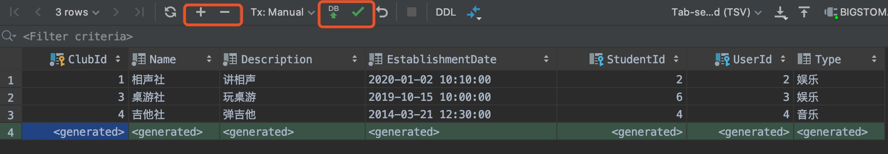
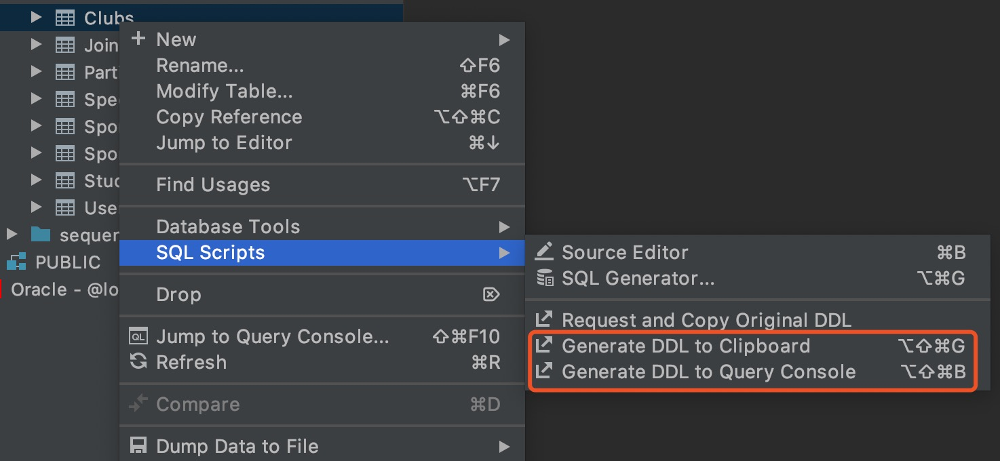
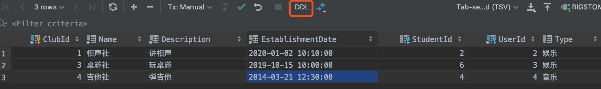
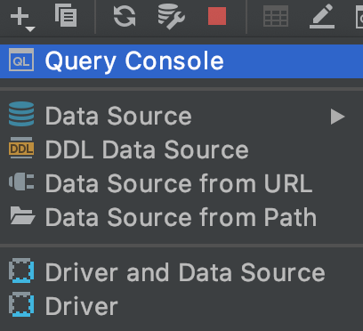

# ClubManager
## 开发流程
### DataGrip
1. 左边栏"+"号选择"Data Source"->Oracle  

2. 在弹出窗口中的红色框内输入相应的数据，密码和用户名相同，尝试连接成功后apply  

3. 能够看到左边栏出现数据库和相关表结构，展开可以查看字段，双击能够查看内容(没填几个，就学生用户社团一点点)  

4. 增加删除记录(点击"+"/"-"填好之后点击绿色的箭头和绿色的✅)，修改差不多就修改相应的记录再重复绿色的操作  

5. 导出建表语句  

6. 查看建表语句  
 
7. "+"下新建"Query Console",然后可以写sql语句对表进行操作，不要擅自把表结构改了！！  

### .net core
1.项目总体框架
